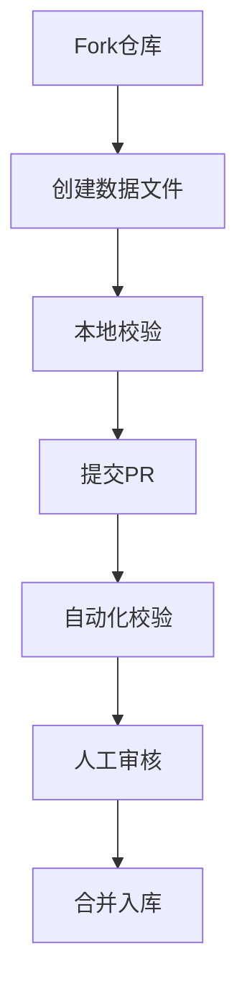

# 贡献指南

[](./CONTRIBUTING.md)
[](docs/commit-guide.md)

欢迎参与原研药数据库建设！以下是贡献指南：

## 贡献流程



## 数据规范

### 1. 数据来源

必须提供至少一个官方来源：

```yaml
references:
  - type: 药监局公告
    url: https://www.nmpa.gov.cn/...
```

### 2. 文件命名

- 路径：`data/`
- 文件名：`{自增ID}.md`

### 3. 数据格式

必须包含YAML元数据块，示例如下：

```yaml
# data/1.md
id: 1
registrationNumber: 国药准字HJ20140344
registrationType: 境外生产药品
productName: 磷酸奥司他韦胶囊
isOriginal: true
originator: Roche Pharma International AG
references:
  - type: 药监局公告
    url: https://www.nmpa.gov.cn/...
```

> 注：YAML块需要用`---`包裹，日期格式使用`YYYY-MM-DD`

## 提交规范

### 1. 分支管理

- 功能分支：`feature/药品名-批准文号`
- 示例：`feature/奥司他韦-HJ20140344`

### 2. Commit Message

遵循如下推荐格式：

```bash
数据：新增达菲®磷酸奥司他韦胶囊(国药准字HJ20140344)
^--^--^-----------------------------
|     |
|     +-> 动词+商品名+产品名称(批准文号/注册证号)
+-> 类型（数据/修复/规范/文档/脚本）
```

### 3. PR要求

- 关联相关Issue（如有）
- 通过CI自动化校验
- 包含完整来源说明

## 审核标准

| 检查项          | 通过标准                          | 检查方式       |
|-----------------|-----------------------------------|----------------|
| 数据真实性      | 提供官方可验证来源                | 人工审核       |
| 格式规范性      | 通过`scripts/validate.py`校验     | 自动化检查     |
| 命名一致性      | 符合schema.yaml定义               | 自动化+人工    |
| 变更必要性      | 非重复数据/有效修正               | 人工审核       |

## 本地开发

1. 安装依赖：

```bash
pip install -r scripts/requirements.txt
```

1. 运行校验：

```bash
python scripts/validate.py data/1.md
```

## 争议处理

如对数据有争议：

1. 在Issue中标注`数据存疑`标签
2. 提供反驳证据
3. 等待维护者仲裁

## 联系方式

- 问题反馈：[Issues](https://github.com/dongzhenye/yuanyanyao/issues)
- 讨论区：[Discussions](https://github.com/dongzhenye/yuanyanyao/discussions)
